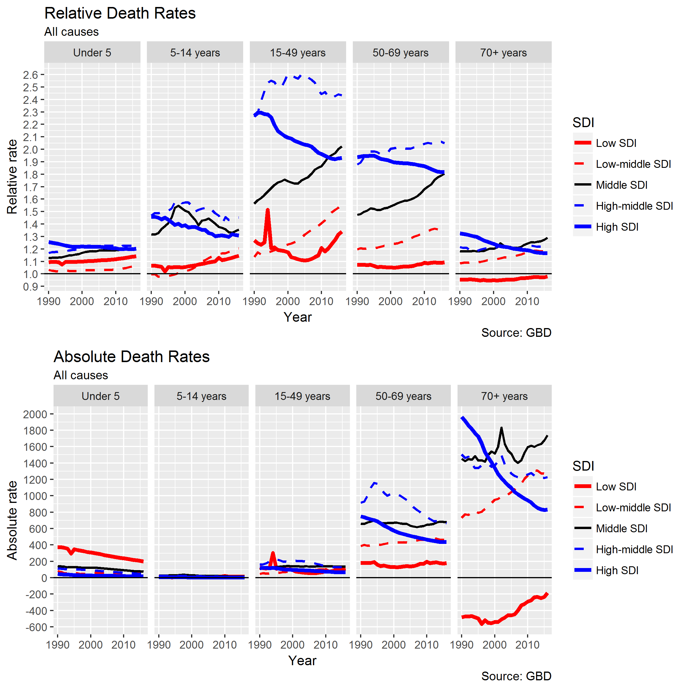
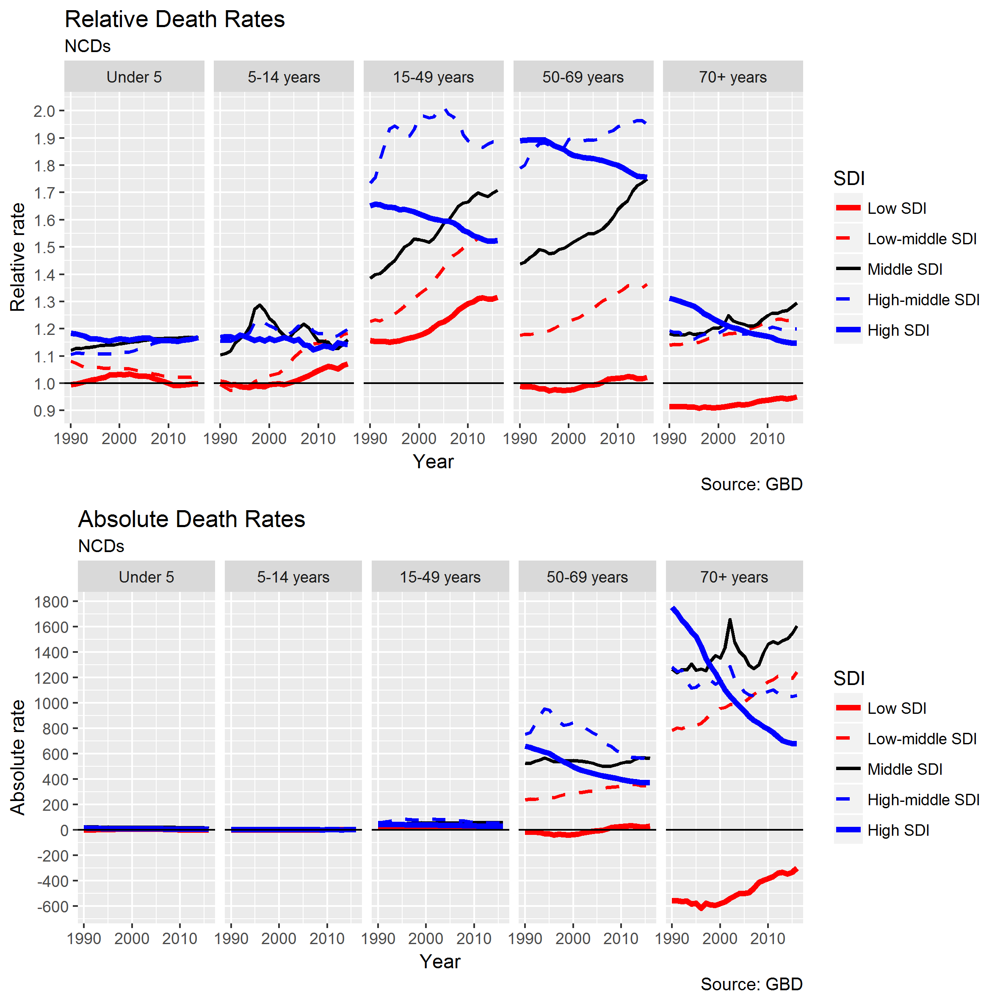
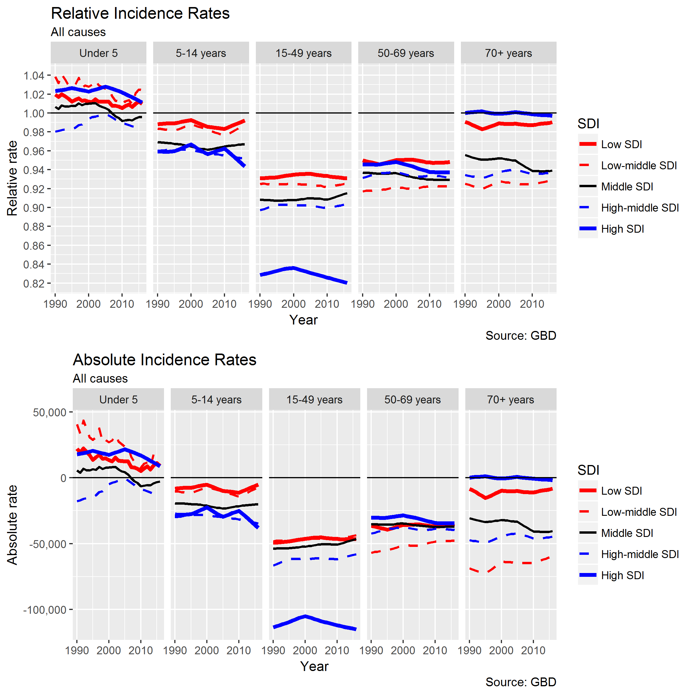
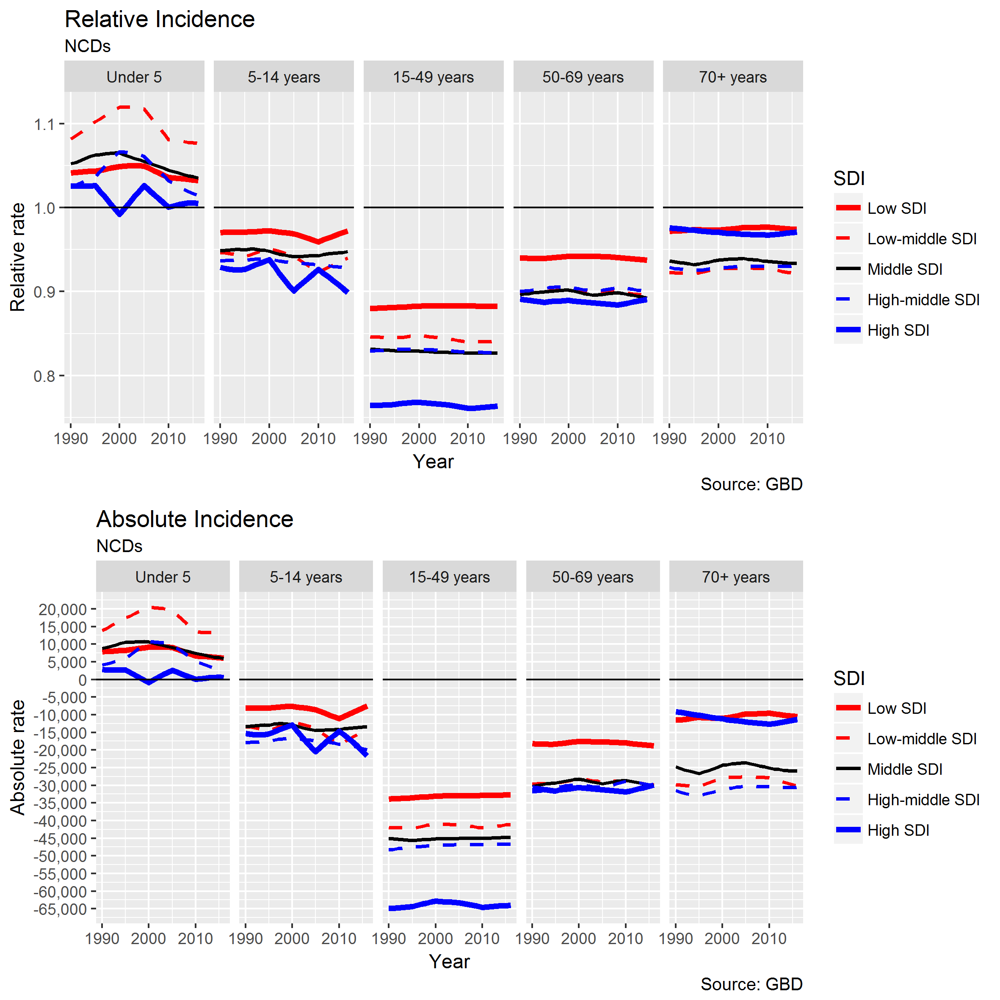
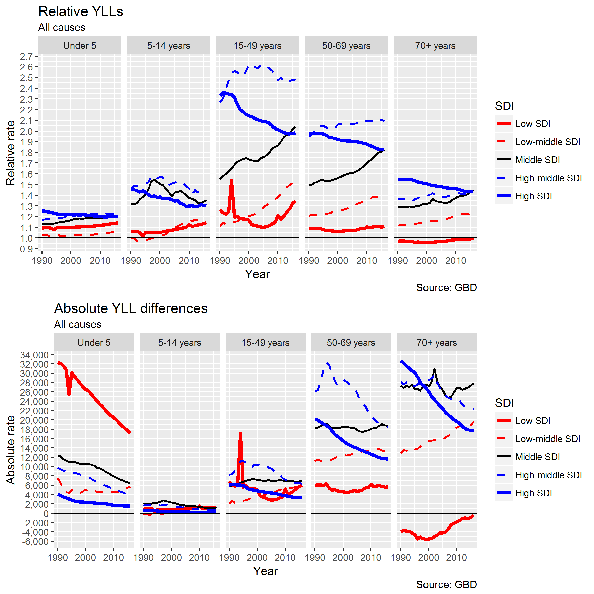
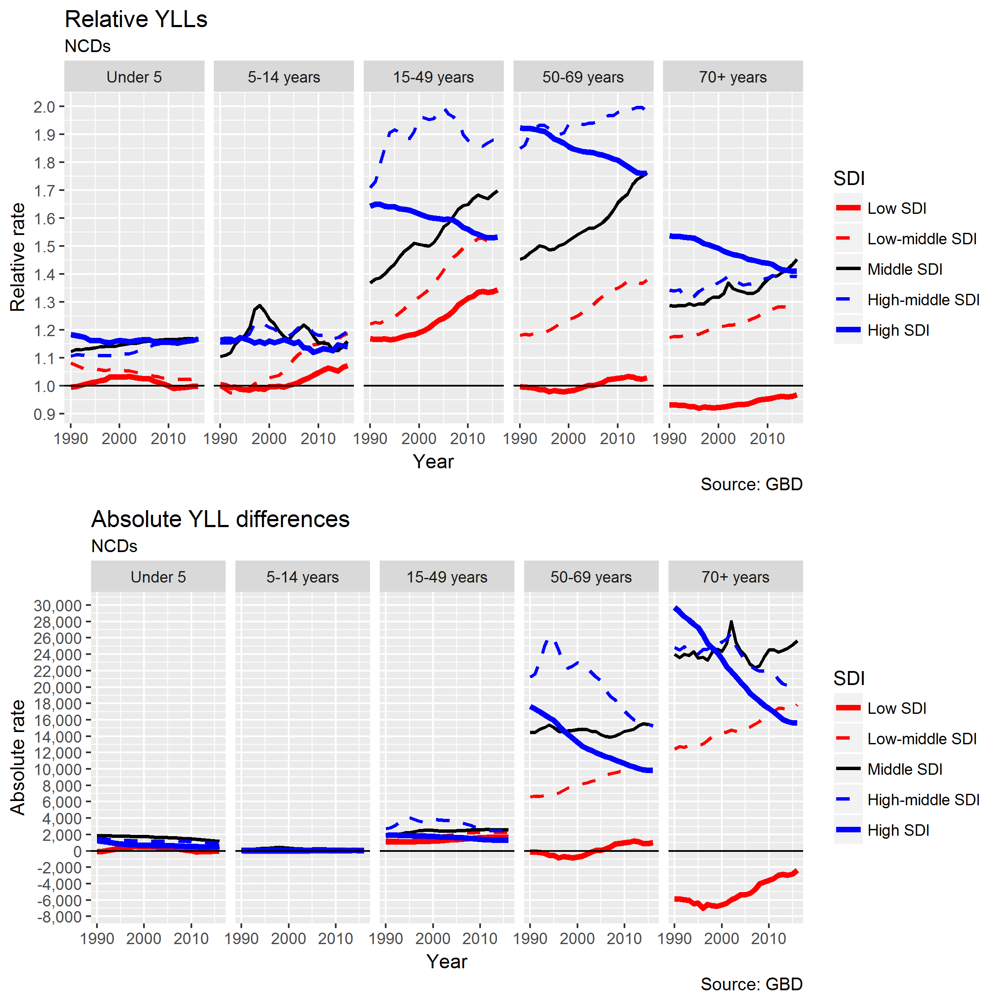
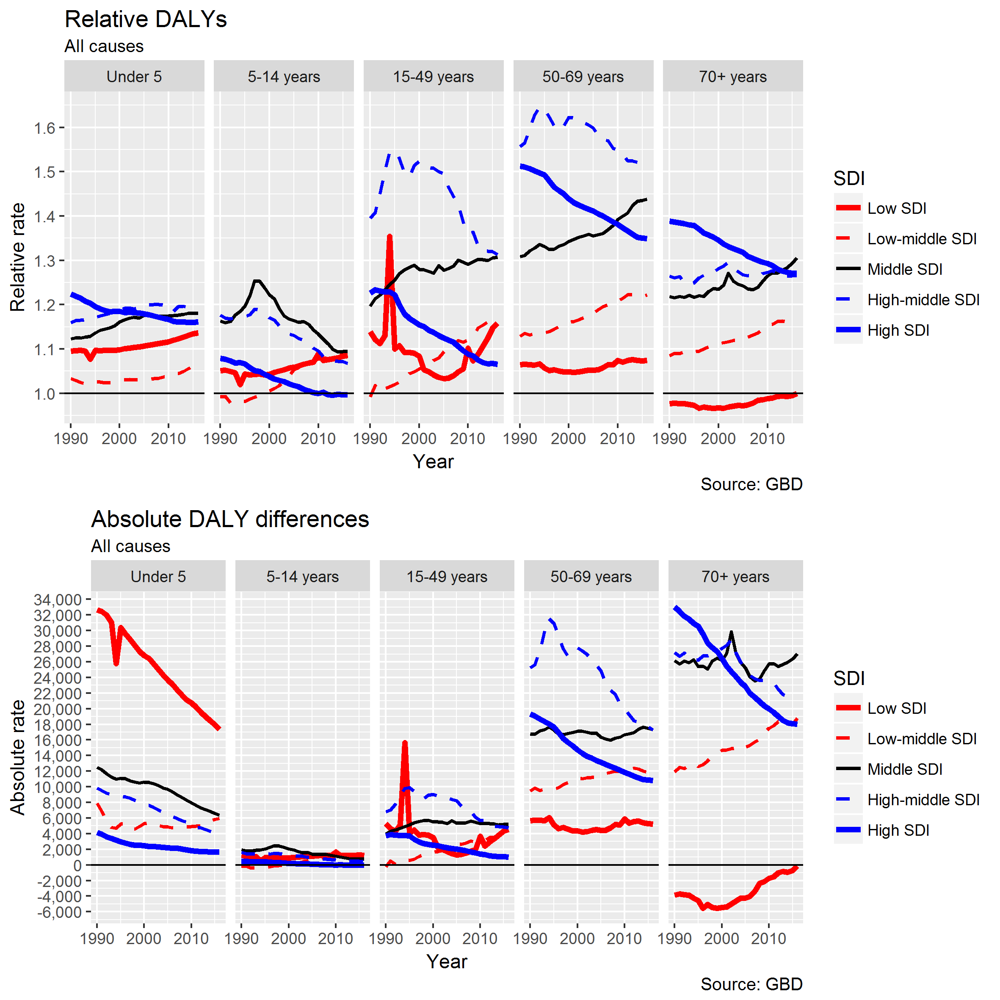
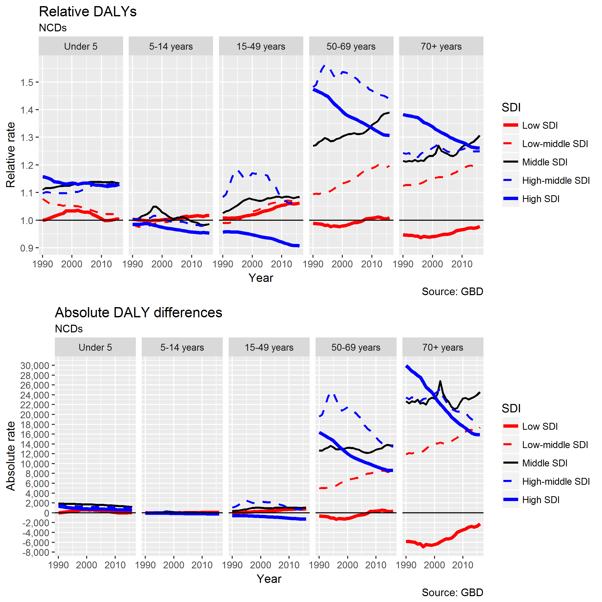

## Relative and absolute gaps in all-cause mortality 

The following figures show relative and absolute gender gaps in all-cause mortality by age group and Sociodemographic Index (SDI) group. 

What the above figure shows is that, though the relative gender is greatest in the 15-49 age group, the absolute difference tends to be greates at the 70+ age group. In terms of differences by SDI, there is a non-monotonic and complex relationship. When considering relative differences the Low SDI regions tend to have lower gender inequalities, and more advantaged popualtions to have have greater *relative* inequalities in the 15-49 age range. However, the trends within SDI regions are not alike. For middle SDI and low-middle SDI regions, they tend to be increasing; for high SDI regions to have been decreasing. In terms of absolute differences (additional male deaths / 100000), the rates are negative for low SDI and to be decreasing in High SDI regions. 

Turning now to relative/absolute gender inequalities by NCDs, separated by age group and SDI, we can see that relative inequalities tend to be highest, and increasing, in the 15-49 and 50-69 age group, whereas absolute differences in death rates per 100 000 tend to be greatest in the 70+ age group.

Separating out these differences by SDI, we see a general trend for low/middle SDI for relative inequalities to increase in the 15-49 age group, to have plataued at around 1.9 for the high-middle SDI population, and to be falling for the high SDI group. A similar trend in relative inequalities is also apparent in the 50-69 age groups.

When considering absolute death rate differences, the greatest differences are in the 70+ age group. In the low SDI regions they are negative (higher female death rates) but positive for all other SDI regions. Within the high SDI group, which used to have highest differences in rates, the absolute gap has been falling. 

It is important to compare these gendered health inequalities in death rates with equivalent figures showing relative/absolute differences in disease incidence, as shown below: 

When looking at differences in incidence, there tends to be a greater incidence rates for females than males, in particular in high SDI regions, where relative inequalities in mortality tend to be greatest. Such findings are already well known and referred to as the Gender Morbidity-Longevity Paradox [REFERENCES]

Gender inequalities in disease incidence tend to have remained constant for different SDI groups for both all disease incidence, and NCD-related disease incidence. 

## Years of life lost 

The following figures show relative and absolute inequalities in years of life lost, both overall, and through NCDs only. 

Absolute differences in YLLs have been falling in the under 5s, as well as converging, with the fastest falls in the low SDI regions. Absolute differences tend to be smallest in childhood and highest from age 50 onwards. There is a notable spike in low SDI regions in the early 1990s, likely as a result of war/conflict. 

In terms of relative inequalities in YLLs, the differences tend to increase for low/low-middle SDI regions, and to be highest in the 15-49 age group. These relative differences in YLLs tend to have been increasing for low/low-middle SDI groups over time, to be high and plateauing (around 2.5) for high-middle SDI, and falling for high SDI regions. Absolute differences are negative only in the 70+ age group within low SDI regions. 

Inequalities in YLLs due to NCDs exhibit somewhat difference patterns. Relative inequalities tend to be most pronounced from age 15, in particular 15-49 age groups. These tend to be increasing for low, low-middle and middle SDI age groups. They have also been increasing/plateauing for the high-middle SDI groups, and falling for high SDI age groups. The absolute differences are greatest for age 50-69 and 70+ age groups. As with all cause YLLs, negative absolute differences are only apparent in low SDI populations in the 70+ age group. 

We will now look at relative/absolute differences in disability-adjusted life years (DALYs)

Relative DALY differences tend to be greatest in the 15-49 and 50-60 year age groups. They tend to be increasing with SDI between low to high-middle SDI groups, but falling and lower in high SDI population groups. Within both absoulte and relative differences, within low SDI populations a spike is apparent in the 15-49 year age group, again consistent with mortality due to war/conflict. There is again a tendency for inequalities to be reducing age groups in the high SDI populations, but not to the same extent in high middle SDI. Abslolute differences have beeen falling and converging in the under 5s. Once again there is a negative DALY difference in low SDI regions in the 70+ age group.  

Looking at relative and absolute differences in DALYs due to NCDs only, the spike in low SDI groups is no longer apparent, consistent with the spike being due to extrnal causes not NCDs. There are higher rates of female DALY burden in 5-14 and 15-49 year age groups, which has been increasing over time. In older age groups, both absolute and relative differneces tend to have been falling in high SDI populations. In other SDI populations the differences tend to increase from age 50 onwards with economic development. They also tend to be increasing over time in the low, low-middle and middle SDI groups. Once again, it is only in low SDI groups there is a higher female than male DALY burden. 

